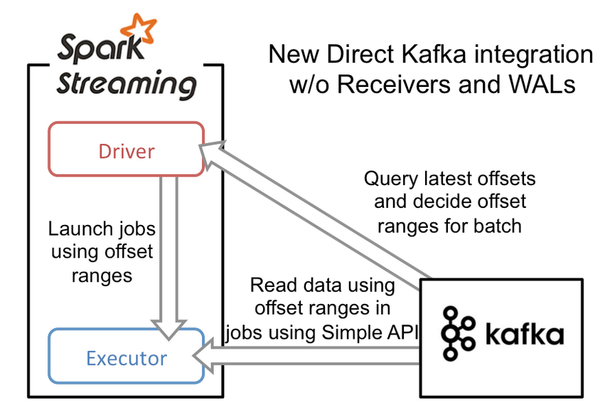

# spark_learning

0) https://spark.apache.org/docs/latest/cluster-overview.html

1) https://spark.apache.org/docs/latest/submitting-applications.html#master-urls

2) https://spark.apache.org/docs/latest/configuration.html

3) https://spark.apache.org/docs/latest/submitting-applications.html

4) https://jaceklaskowski.gitbooks.io/spark-streaming/spark-streaming.html

5) https://jaceklaskowski.gitbooks.io/spark-streaming/spark-streaming-kafka.html

#### Question-Answers:

1) https://stackoverflow.com/questions/44590284/number-of-executors-in-spark-local-mode

2) https://stackoverflow.com/questions/34701350/does-any-daemon-run-when-spark-is-in-local-mode?rq=1

3) https://metabroadcast.com/blog/design-your-spark-streaming-cluster-carefully

4) 

#### Kafka spark streaming integration

https://databricks.com/blog/2015/03/30/improvements-to-kafka-integration-of-spark-streaming.html

https://databricks.com/blog/2015/07/08/new-visualizations-for-understanding-apache-spark-streaming-applications.html

https://spark.apache.org/docs/latest/streaming-kafka-0-8-integration.html

https://www.linkedin.com/pulse/enable-back-pressure-make-your-spark-streaming-production-lan-jiang/

https://blog.clairvoyantsoft.com/productionalizing-spark-streaming-applications-4d1c8711c7b0

https://github.com/koeninger/kafka-exactly-once/blob/master/blogpost.md

https://databricks.com/wp-content/uploads/2015/03/Screen-Shot-2015-03-29-at-10.14.11-PM.png

http://spark.apache.org/docs/latest/streaming-kafka-integration.html

https://stackoverflow.com/questions/42091843/spark-streaming-batch-interval-vs-processing-time?rq=1

https://spark.apache.org/docs/latest/configuration.html

https://stackoverflow.com/questions/41022367/set-spark-streaming-kafka-maxrateperpartition-for-createdirectstream

https://stackoverflow.com/questions/36501651/kafka-topic-partition-and-spark-executor-mapping?rq=1

https://stackoverflow.com/questions/37810709/kafka-topic-partitions-to-spark-streaming?rq=1

